# FIFA '21 Data Cleaning Documentation

## Overview

This document outlines the data cleaning process for the FIFA '21 🎮 dataset. This dataset was provided as part of the #DataCleaningChallenge hosted by the amazing duo of Chinonso ([@PromiseNonso_](https://twitter.com/PromiseNonso_)) and V. Somadina ([@VicSomadina](https://twitter.com/VicSomadina)) as a means of pushing data enthusiasts into new territory in data cleaning and analysis while giving a somewhat, real-life experience that is different from the "classroom" experience. The goal of this process is to ensure that the dataset is accurate, complete, consistent and ready for analysis.

I chose to use MS Excel for the purpose of trying my hand out on data cleaning with this software. It was an awesome experience. 😁

## Data Sources

The dataset was made available by the challenge moderators on Telegram and Whatsapp; it was originally sourced (on [Kaggle](https://www.kaggle.com/datasets/yagunnersya/fifa-21-messy-raw-dataset-for-cleaning-exploring)) by scrapping data from [sofifa.com](https://www.sofifa.com) which is readily and publicly available.

## Data Cleaning Process

The data cleaning process involved the following steps:

1.  **Data Exploration:** The first step was to explore the dataset and identify any potential issues. The first major issue noted was the issue of special characters encounter with some names with Spanish specialised characters and with the Euro currency symbol.
	- 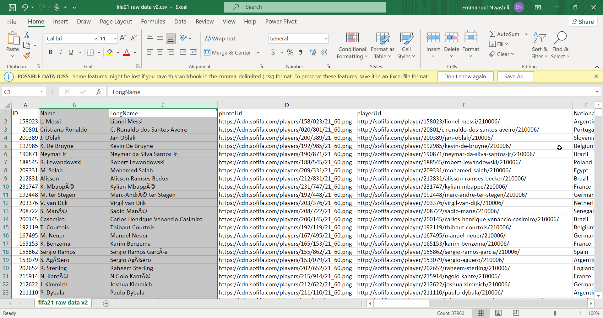
	- This was remedied by loading up my data through Excel's Power query and changing my character encoding to **Unicode UTF-8**.
	
Before Character Encoding Change | After Character Encoding Change
:-----------------------:|:--------------:
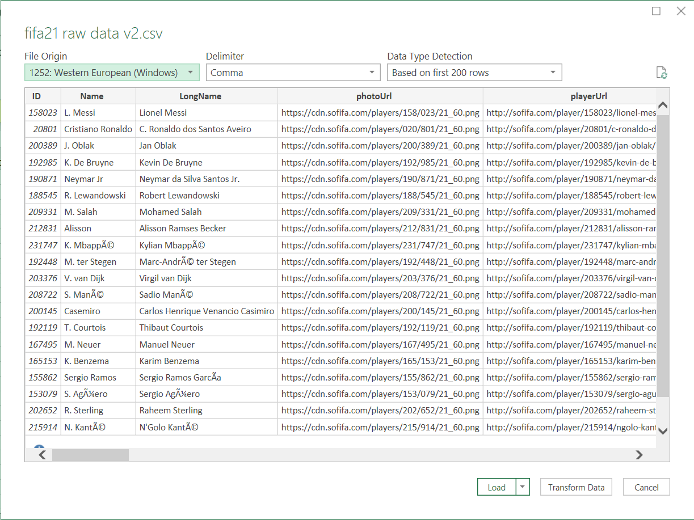 |
    
2.  **Data Cleaning:** Once the issues were identified, the data was cleaned. This involved a combination of manual and automated processes. For example, inconsistent columns were standardised, columns with the star symbols were cleaned to make them integers and processing ready, values were converted from their short forms (M and K) to their full form which was in thousands and millions.
    
3.  **Data Verification:** Once the data cleaning process was complete, the dataset was verified to ensure that all issues had been resolved. This involved checking the cleaned data against the original data sources and verifying that the data was consistent and accurate.
    
4.  **Documentation:** Finally, the data cleaning process was documented to ensure that it could be replicated in the future. This included documenting the cleaning steps taken, any issues that were identified, and the final cleaned dataset.
    

## Data Cleaning Documentation

As good practice, I always backup the raw data before I start any data cleaning. This is simply done by copying the data to a new sheet within the workbook. 

### Contract Column

Before Contract Column | After Contract Column
:-----------------------:|:--------------:
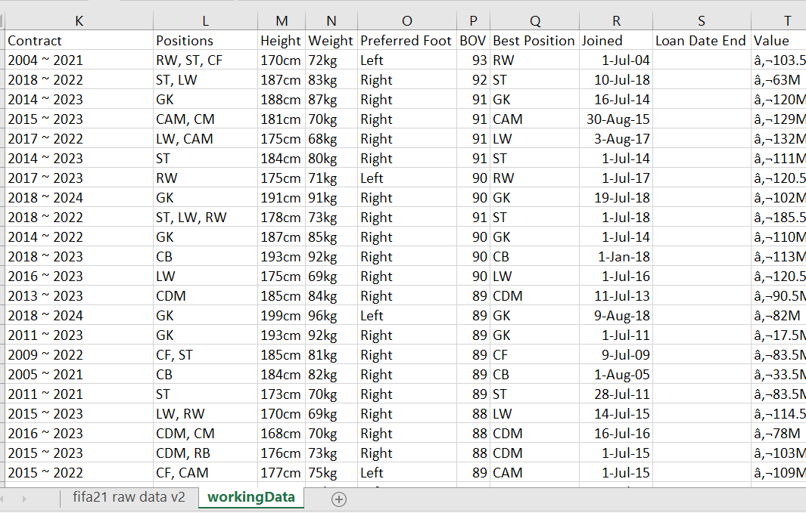 | 

I needed to split the contract column into a form which can be used in analysis. I felt having it in two columns "Contract start" and "Contract end" would be the best option to achieve my goal.

Firstly, I used the **Text to Columns** tool to split up the column using **_Space_** as delimiter; not forgetting to insert new blank columns which the "new" data would fall into.

Then, I deleted the middle column which contains the **~** character as this isn't necessary for my analysis, followed by renaming the columns; from **Contract** and a nameless column to **Contract Start** and **Contract end**.

Using the **Filter** tool (I use this to check every column to have a quick overview of the columns contents) on the new columns, I realised that **Contract start** had some "Months" in it even though it was majorly a "year column". Using the **Find and Replace** tool, I replaced each of the months with the year 2021 as this was the year that they indicated at the time the data was created.

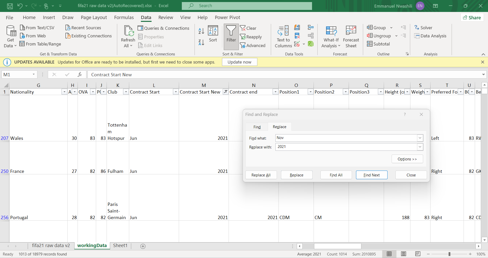

This leaves us with two standardised columns of the player's contract year.

### Positions

The **Positions** column was rather in good shape except that all possible positions of the player were lumped in a column. To make things easier, I broke this table down into three (as I noticed that each player had a maximum of 3 playable positions) columns using the **Text to Columns** tool , having set my delimiters to **Space** and **comma(,)**.

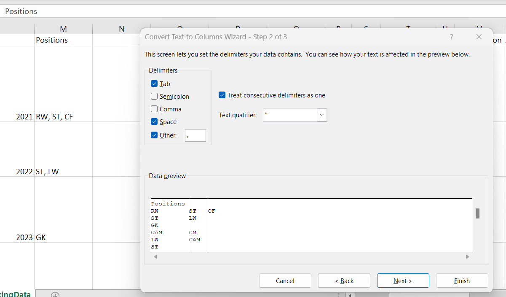

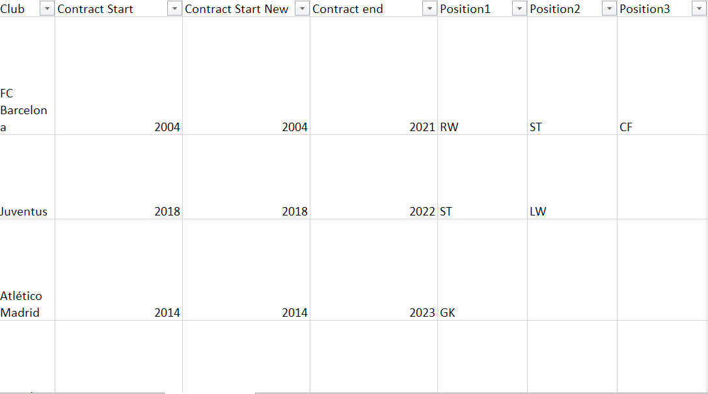

### Height

Looking through the data for the **Height** column, I noticed some inconsistency. The data in that column comprised of heights in **cm** and in **ft in(' ")**.
Firstly, I used the **Filter** tool (this is definitely one of my favourite cleaning tools 🧹🧼🪥🫧) to list only heights in the **ft in** format by filtering for an **apostrophe (')**.

Then using **Text to Columns** with delimiters set to **Space** and **apostrophe (')**, I split the column into heights in foot and inches.

Pushing further, I ran another **Text to columns** conversion this time using **Quotaton marks (")** in place of **apostrophe (')**. This is to clear the quotation marks on the inches attribute. This could also be done by running a **Find and replace** on the column (Q).

Since I had decided that "cm" would be my standard measure, i ran the formula **SUM(CONVERT(P795, "ft", "cm"), CONVERT(Q795, "in", "cm"))** in the **R** columns which converts the foot measurements to centimetres and adds it to the inch measurements converted to centimetres.

Following this, I cleared the filter and ran a **Find and Replace** on the Height column (P), replacing "cm" so that only integer values are left in the column.

Inserting a column between the P and Q (which makes the present Q into R) columns, I then used the formula **IF(R2="",P2,R2)** to merge the values of column P and R (if R isn't empty) as one column (Q) **Height (cm)**. Copying the values of Q, I **pasted it's values only** over column P and deleted column Q and the other non-valuable columns R and S.

### Weight

A similar process to that of height, listed above, was carried out on weight to make it analysis ready.

### Value

After removing all the Euro symbols using a **Find and Replace**,I filtered the column for "M". I then used **Find and Replace** on the Value column to remove the M which indicated the value was in millions then multiplied the resultant number by 1000000 to get the actual value and I stored that in a new column.

I applied the same method on the thousands by search for **K**. Then applying  similar formula as used to merge the height columns, I merged the value columns. This was followed by deleting the extra columns gotten from these steps after replace **weight** with he new and standardised **Weight (kg)**.

Same procedure was carried out on the **Wage** and **Release clause** columns to standardise them; "Wash, rinse, dry."

### ...And Some Unpivoting

So, after a veeery long time of staring at the dataset and a night with less than optimal rest, I woke up to realise that the "something more" I could do with my data was put the **Positions** columns in a tidier and more "_relatable_" manner.

Firstly, I needed to convert the data to tables so as to ease the following measures we would need to execute. After converting it to a table (I called **data**), I opened _Power Query_ on the table via **Get & Transform Data > From Table/Range**.
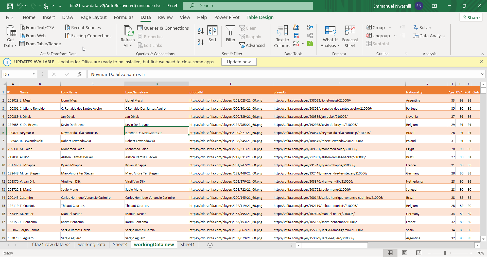

#### Creating the Positions Table
This opens up _Power Query _ with the **data** table's content. Select the **ID**, **Position1**, **Position2** and **Position3** columns and select **Remove other Columns** so that only the selected columns are left behind.
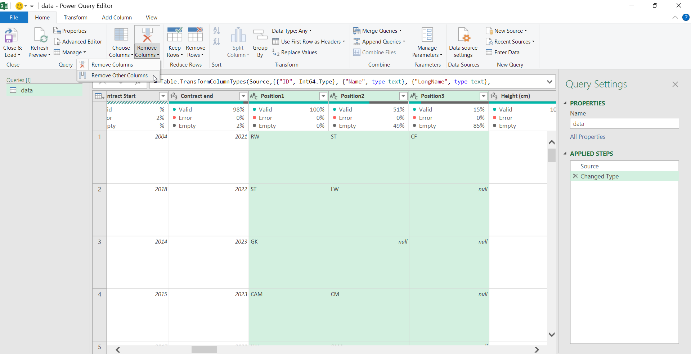

Selecting the **ID** column, "**Unpivot Other Columns**" so as to bring all positions into a single column while aligning them to the related footballer **ID**.

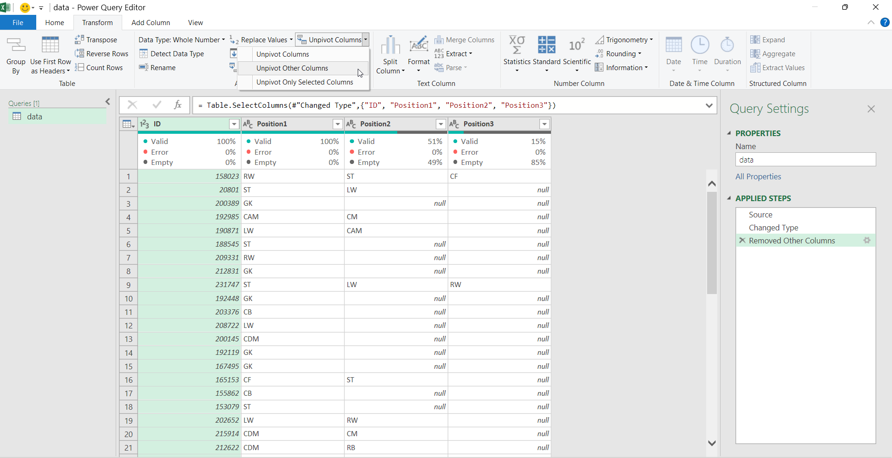

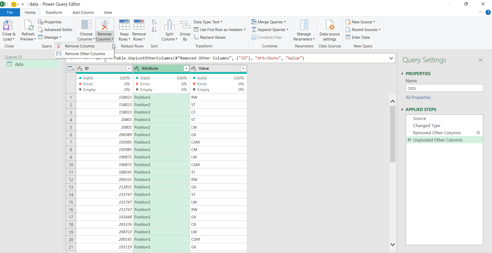

Delete the middle column whose attributes are _Position1, Position2_ and _Position3_ and rename the table from **data** to **position_rel** (this is just my preference to show this is a relational table.)

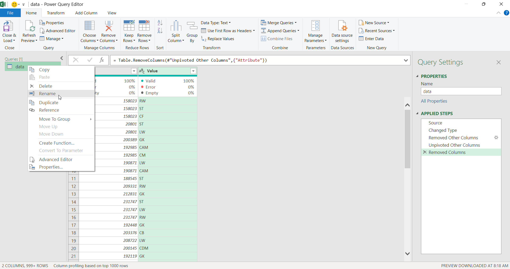

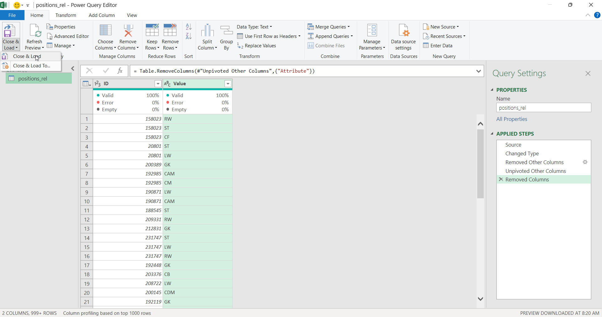

Then rename **Value** column to **Positions** and hit **Close and Load**.

#### Creating the new optimised Data Table
Open **data** again in _Power Query_, then remove the **Position1, Position2** and **Position3** columns.

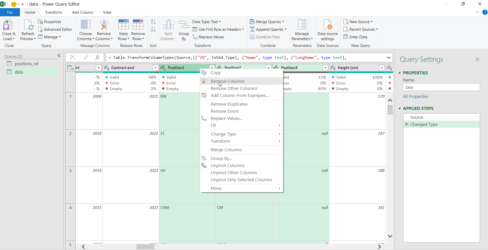

Rename table from **data** to **data_rel**, then **Close and Load**.

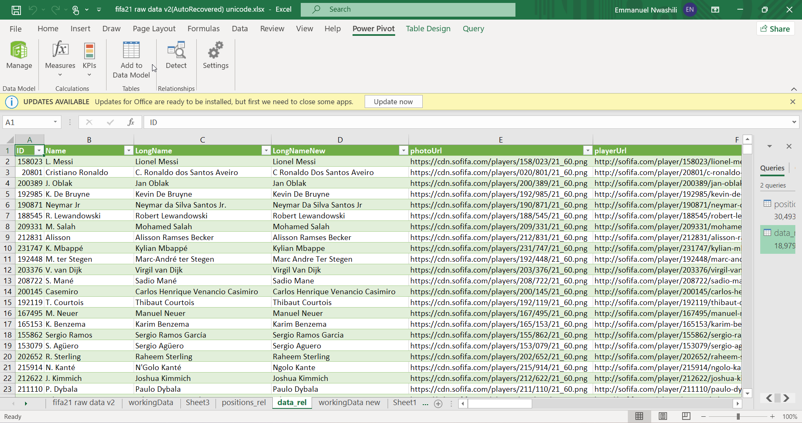

Add the new table **data_rel** (a cell in the table must be selected) to the data model (as shown in image above) using **Power Pivot**.
Close and repeat the same process for the **positions_rel** table.

### Building Relationships

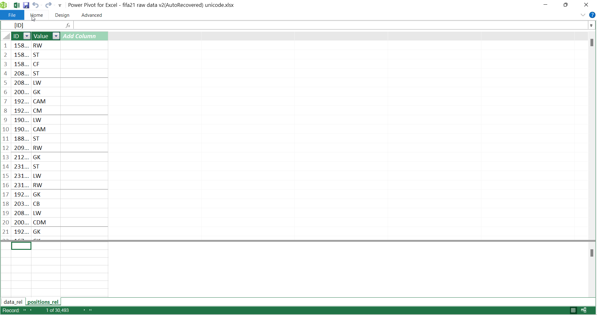

The Diagram (Table) view of the model should be something like this

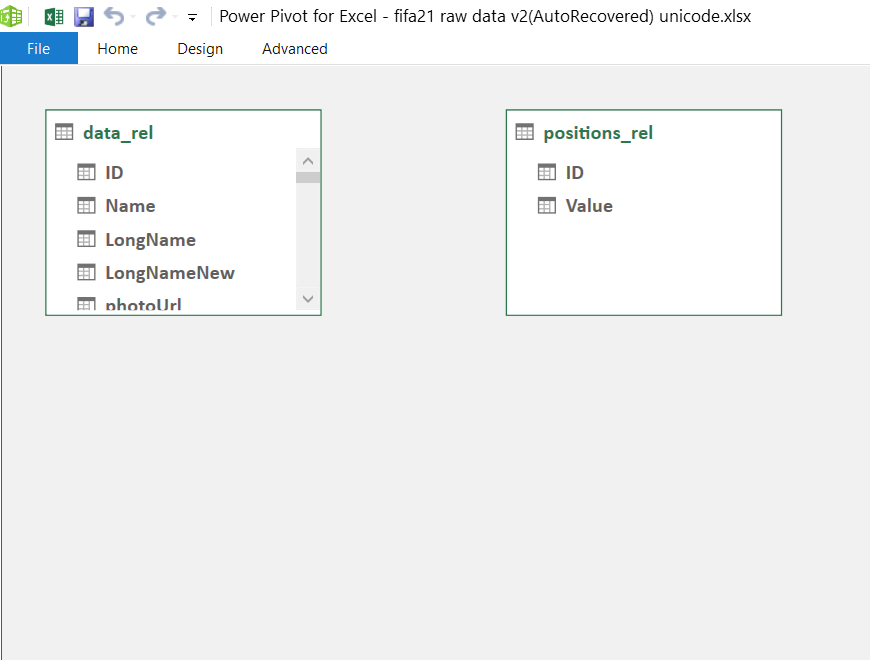

Click and drag the **ID** column of the **data_rel** table and drop it on the **ID** column of **positions_rel** to create a relationship between both tables.

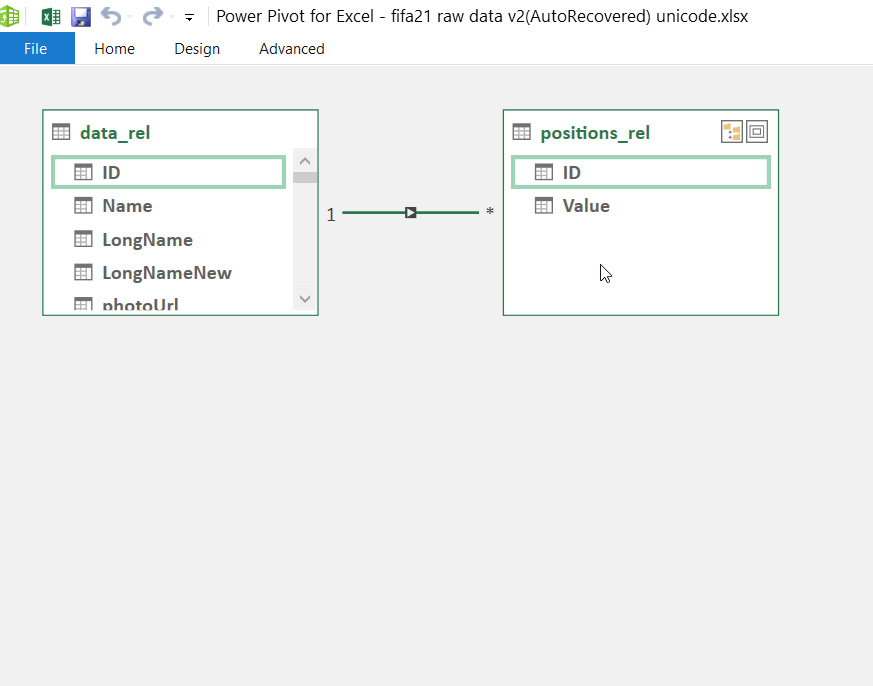

This completes the process of unpivoting and linking the tables.

## Data Cleaning Results

The data cleaning process resulted in a cleaned dataset that was ready for analysis. The final dataset had the following characteristics:

-   No inconsistencies or outliers
-   Data was accurate and complete
-   The dataset was well-organized and easy to work with

Thankfully, the dataset was made up of unique values so there was no issue of duplicates.

Also, I left the **photoURL** and **playerURL** just in the situation where they would be needed for visualisation.

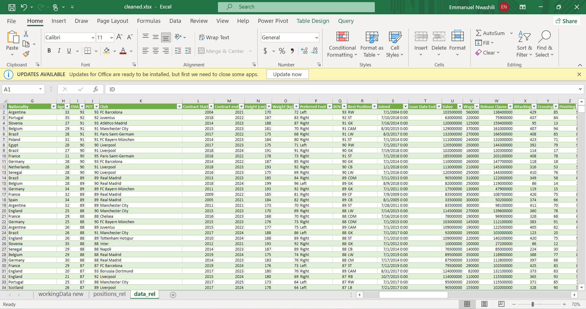

## Conclusion

The data cleaning process was successful in ensuring that the FIFA '21 dataset was accurate, complete, and consistent. By documenting the process, future researchers will be able to replicate the cleaning process and work with the cleaned dataset, even though data cleaning is never a "one size fits all" thing.

You can reach me on [Twitter](https://twitter.com/emmanwashili) or [LinkedIn](https://www.linkedin.com/in/emmanuel-nwashili-7051097b)

#datacleaning #msexcel #excel #powerquery
